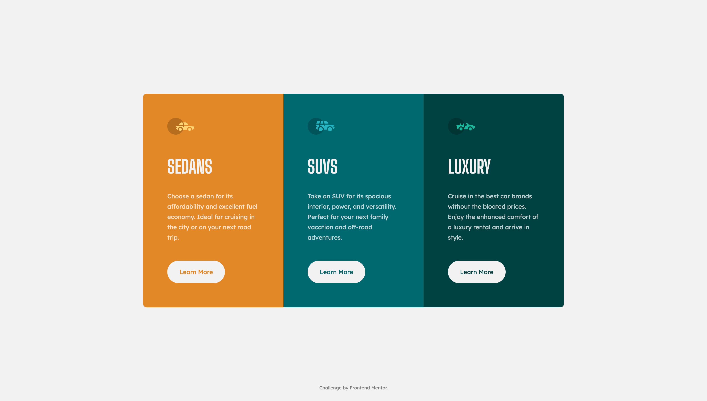
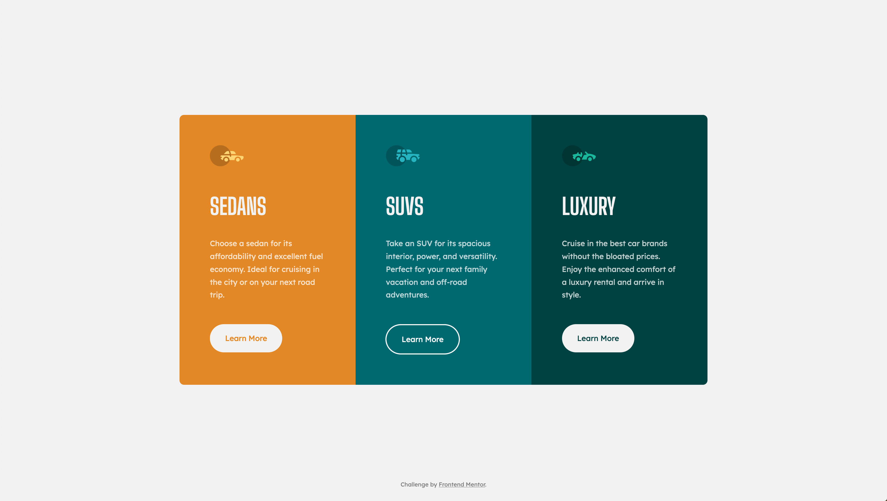
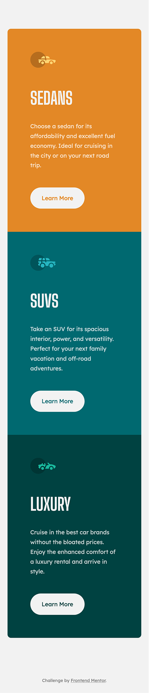

# Frontend Mentor - 3 Column Preview Challenge

This is my coded solution to the 3 Column Preview Challenge from Frontend Mentor
https://www.frontendmentor.io/challenges/3column-preview-card-component-pH92eAR2-

### The Challenge
- Replicate the design using best visual approximations of measurements (no explicit element positioning or dimesions given) 
- Users should be able to view the optimal layout for both desktop and mobile devices using 1440px and 375px viewport widths respectively.
- See active hover states for all interactive elements

### Built With
- Semantic HTML5 Markup
- CSS3
- Vanilla JavaScript
- Flexbox
- CSS Grid

### Screenshots 

#### Desktop

#### Active Hover States

#### Mobile

### Deployed
https://3-column-preview-hfasl7p9p-alexvalpeter.vercel.app/
