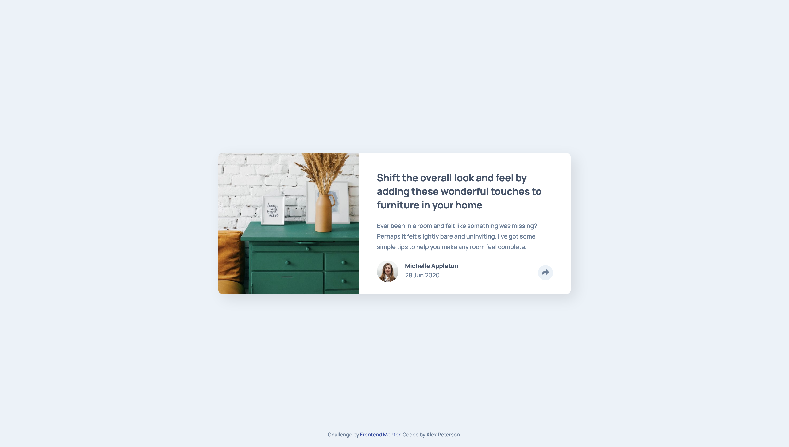
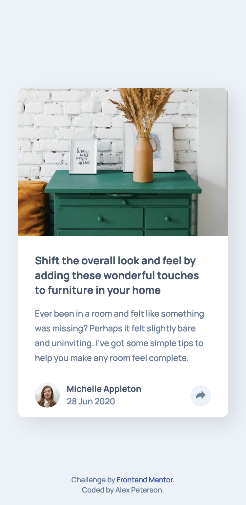

# Frontend Mentor - Article Preview Component Challenge

This is my coded solution to the Article Preview Challenge from Frontend Mentor (https://www.frontendmentor.io/challenges/article-preview-component-dYBN_pYFT)

### The Challenge
- Replicate the design using best visual approximations of measurements (no explicit element positioning or dimesions given) 
- Users should be able to view the optimal layout for both desktop and mobile devices using 1440px and 375px viewport widths respectively
- Show active hover states for all interactive elements
- Reveal social icons by clicking share button

### Built With
- Semantic HTML5 Markup
- CSS3
- Vanila JavaScript
- Flexbox

### Screenshots 

#### Desktop

#### Active Hover States

#### Mobile

