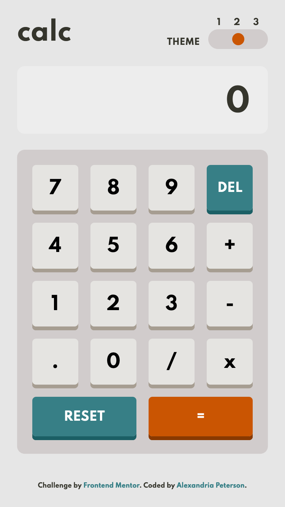

# Frontend Mentor - Calculator App

This is my coded solution to the Calculator App Challenge (https://www.frontendmentor.io/challenges/calculator-app-9lteq5N29)

### The Challenge
 - Replicate the design using best visual approximations of measurements (no explicit element positioning or dimesions given) 
- Users should be able to view the optimal layout for both desktop and mobile devices using 1440px and 375px viewport widths respectively.
- See the size of the elements adjust based on their device's screen size
- Perform mathematical operations like addition, subtraction, multiplication, and division
- Adjust the color theme based on their preference
- Bonus: Have their initial theme preference checked and have any additional changes saved in the browser

### Built With
- Semantic HTML Markup
- CSS (SCSS)
- Mobile-first workflow
- Responsive design
- Flexbox
- CSS Grid
- JavaScript

### Screenshots

#### Desktop

#### Mobile

### Deployed
calculator-6xwaw5yox-alexvalpeter.vercel.app

