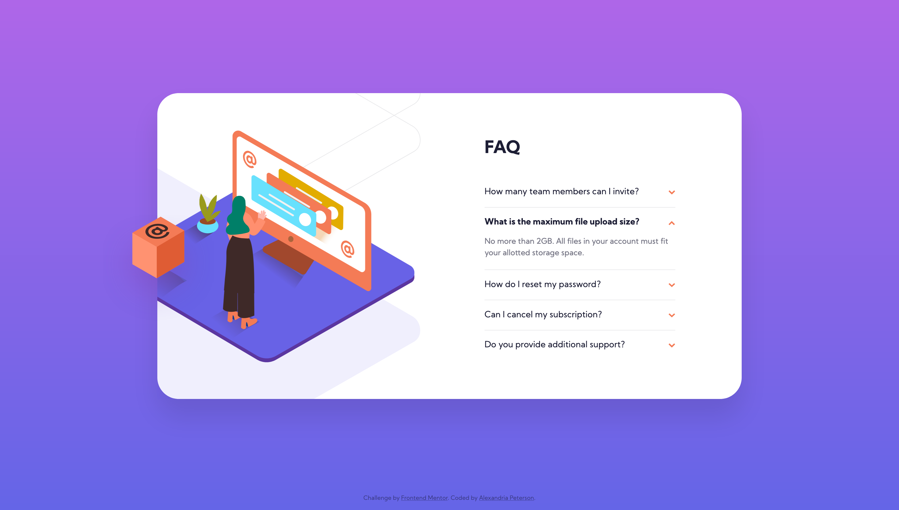
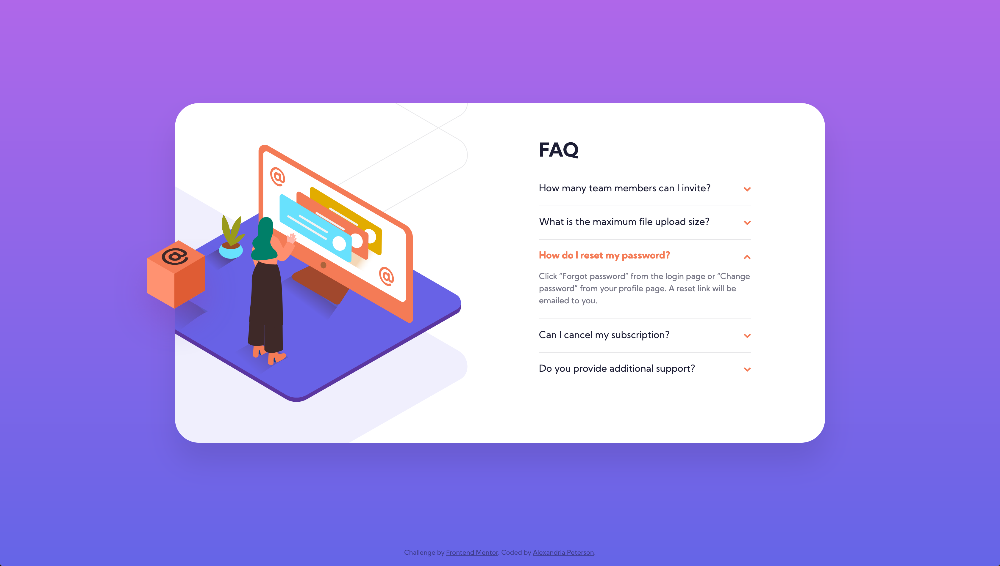
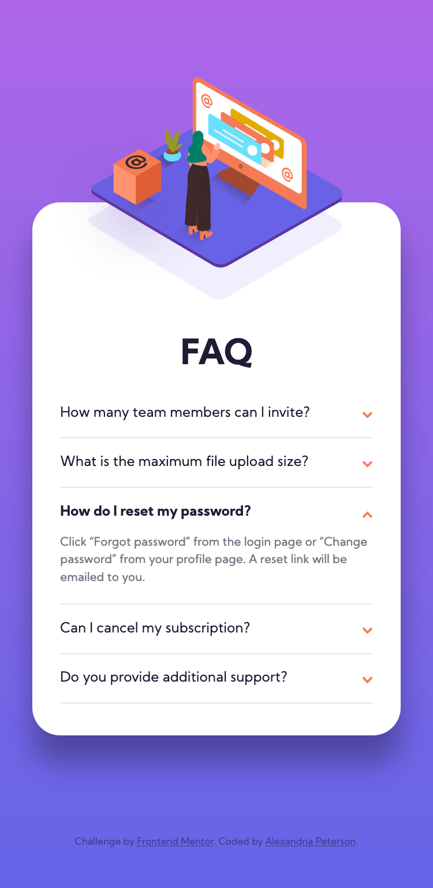

# Frontend Mentor - FAQ Accordion Card Challenge

This is my coded solution to the FAQ Accordion Card Challenge from Frontend Mentor (https://www.frontendmentor.io/challenges/faq-accordion-card-XlyjD0Oam)

### The Challenge
- Replicate the design using best visual approximations of measurements (no explicit element positioning or dimesions given) 
- Users should be able to view the optimal layout for both desktop and mobile devices using 1440px and 375px viewport widths respectively.
- See active hover states for all interactive elements
- Reveal/hide answer on click

### Built With
- Semantic HTML5 Markup
- CSS3
- Vanilla JavaScript
- Flexbox

### Screenshots 

#### Desktop

#### Active Hover States

#### Mobile

