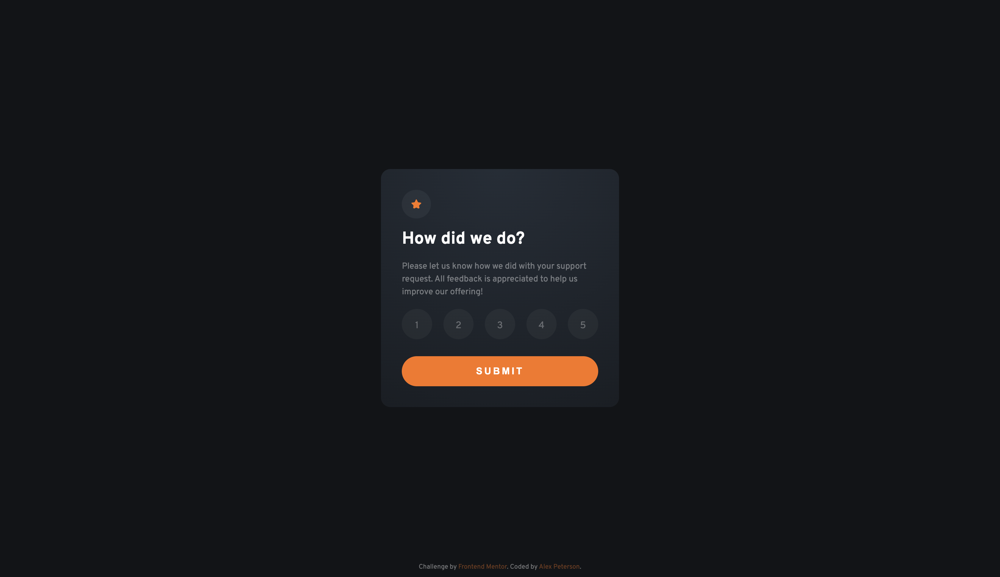
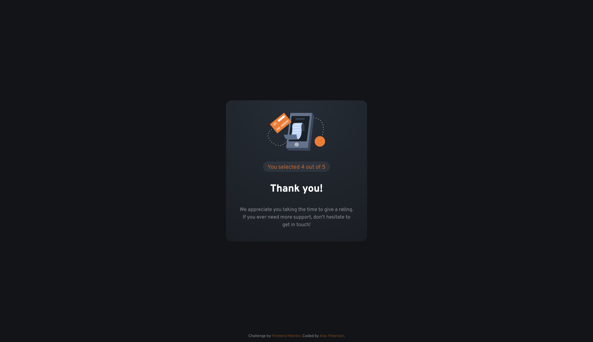
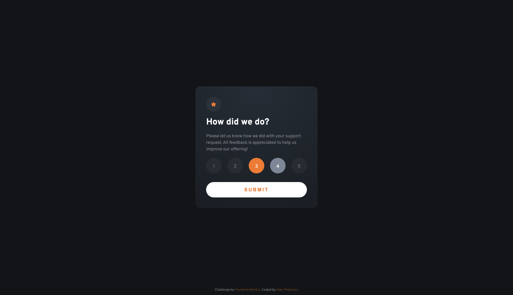
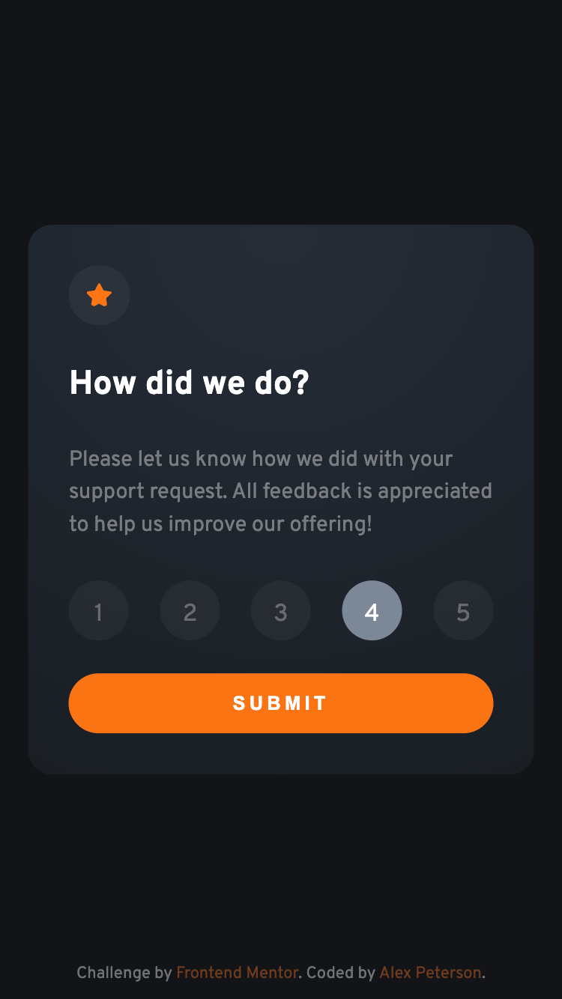
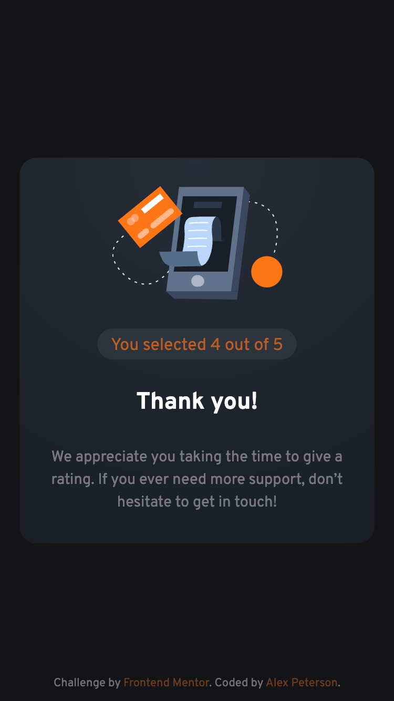

# Frontend Mentor - Interactive Rating Component solution

This is a solution to the Interactive Rating Component challenge on Frontend Mentor (https://www.frontendmentor.io/challenges/interactive-rating-component-koxpeBUmI)

tents based on what sections you keep.**

### The challenge

Users should be able to:

- View the optimal layout for the app depending on their device's screen size using 1440px and 375px viewport widths respectively
- See hover states for all interactive elements on the page
- Select and submit a number rating
- See the "Thank you" card state after submitting a rating

### Built with

- Semantic HTML5 markup
- Flexbox
- Mobile-first workflow
- Javascript

### Screenshots 

#### Desktop

#### Desktop Active States

#### Mobile
    

### Deployed
https://interactive-rating-66anh4wlv-alexvalpeter.vercel.app/
