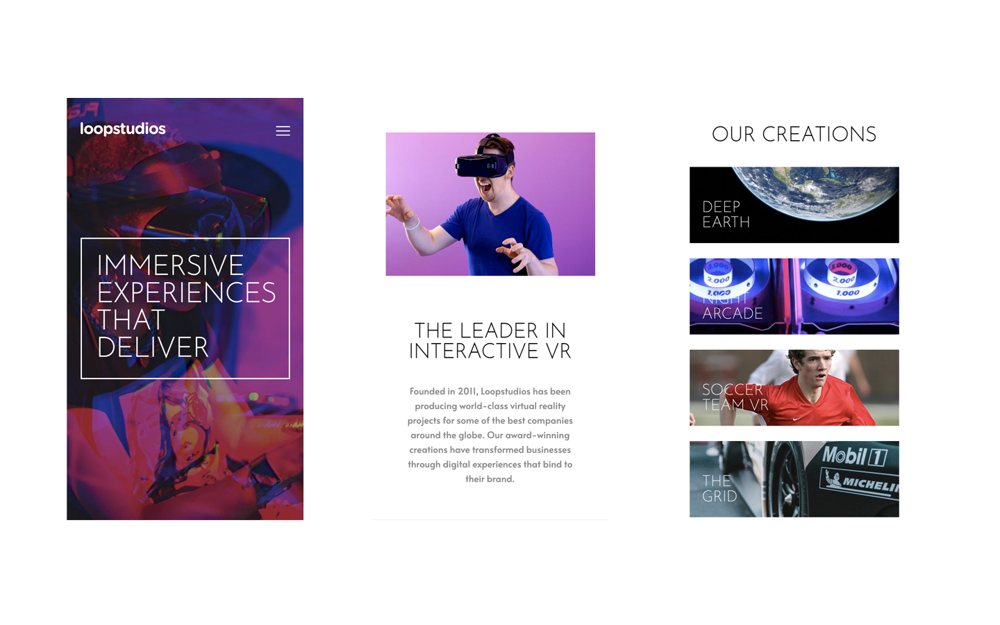
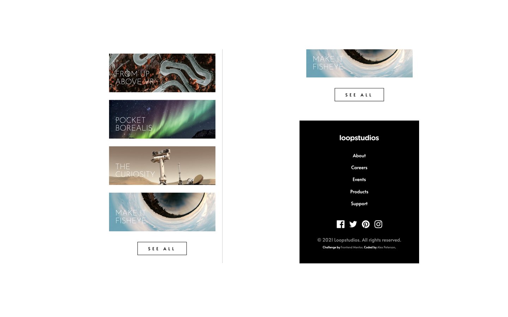
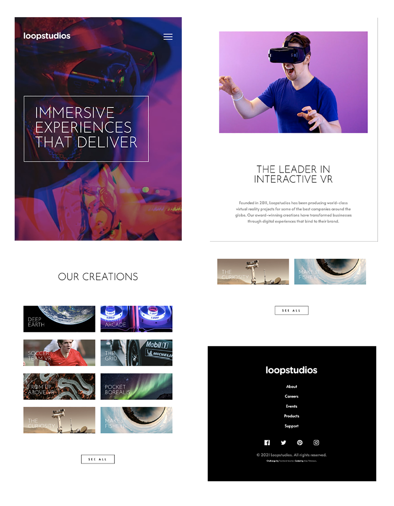

# Frontend Mentor - Loopstudios Landing Page Challenge

This is my coded solution to the Loopstudios Landing Page Challenge from Frontend Mentor
https://www.frontendmentor.io/challenges/loopstudios-landing-page-N88J5Onjw

### The Challenge
- Replicate the design using best visual approximations of measurements (no explicit element positioning or dimesions given) 
- Users should be able to view the optimal layout for both desktop and mobile devices using 1440px and 375px viewport widths respectively.
- See active hover states for all interactive elements

### Built With
- Semantic HTML5 Markup
- CSS3
- Flexbox
- CSS Grid
- Mobile-first workflow
- Responsive design

### Screenshots 

#### Desktop

#### Active Hover States

#### Mobile

#### Tablet 

### Deployed

