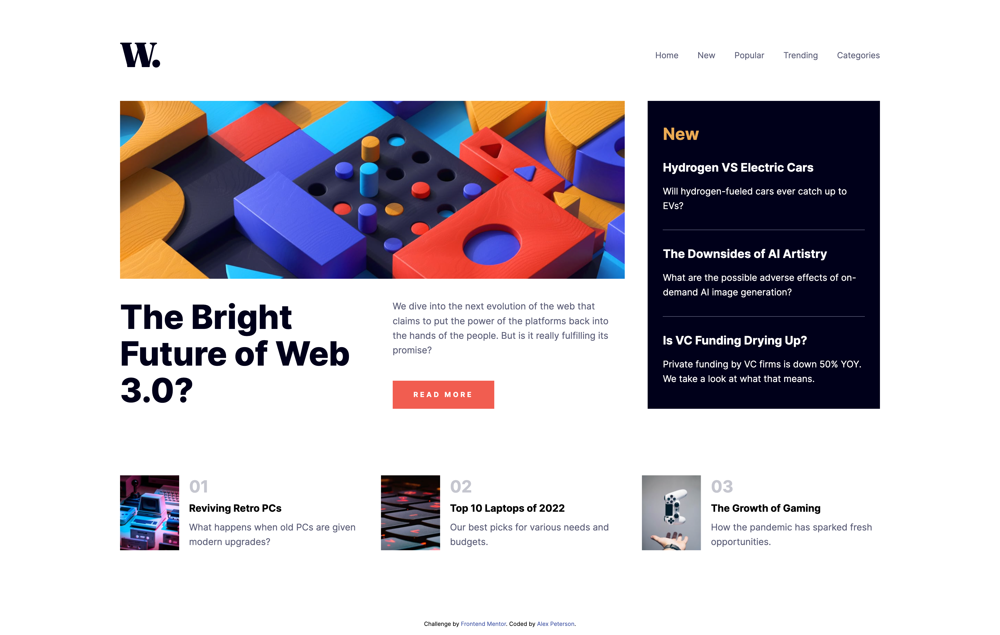
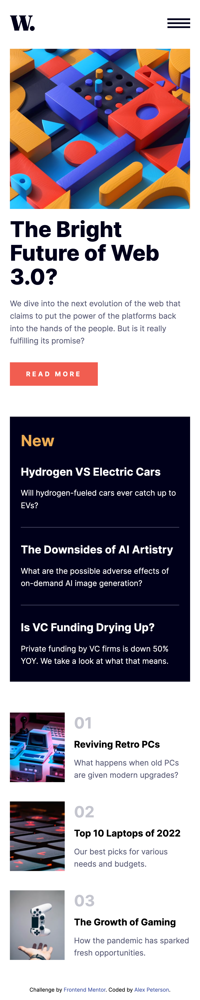

# Frontend Mentor - News Homepage Solution

This is a solution to the [News homepage challenge on Frontend Mentor](https://www.frontendmentor.io/challenges/news-homepage-H6SWTa1MFl).

### The challenge

Users should be able to:

- View the optimal layout for the interface depending on their desktop or mobile device's screen size (using 1440px and 375px viewport widths respectively)
- See hover and focus states for all interactive elements on the page

### Built with
- Semantic HTML5 markup
- Flexbox
- Mobile-first workflow

### Screenshots 

#### Desktop

#### Mobile

### Deployed

https://news-homepage-git-main-alex-petersons-projects.vercel.app/

