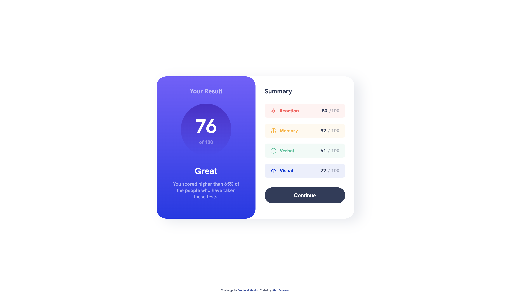
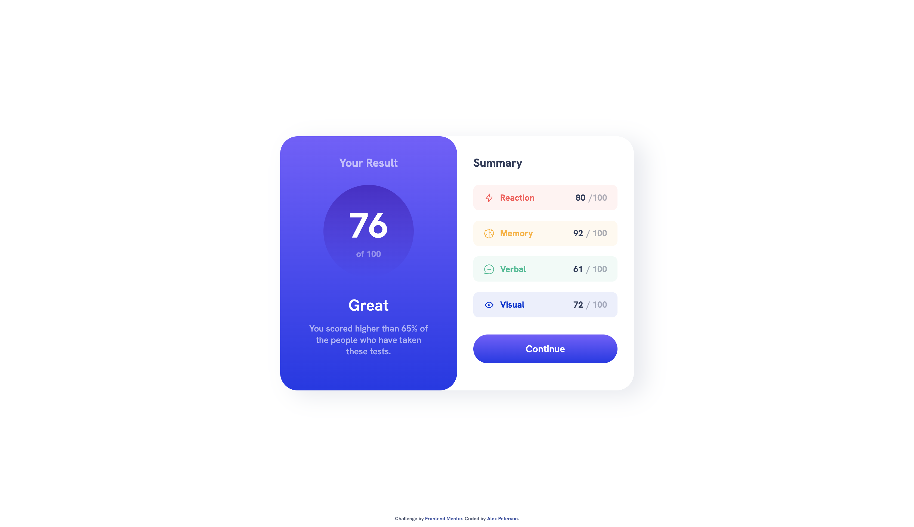
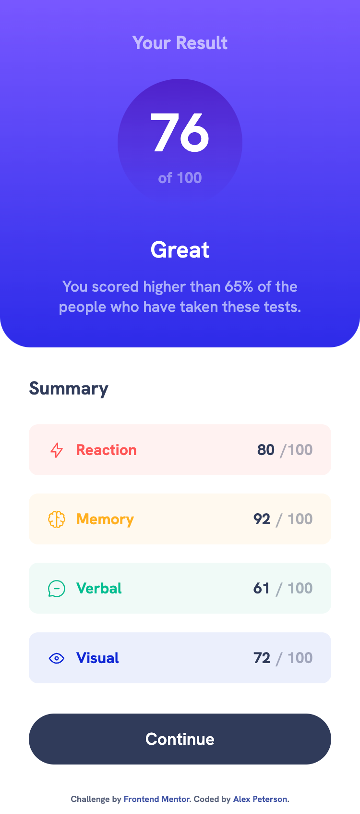

# Frontend Mentor - Results summary component solution

This is a solution to the Results Summary Component challenge on Frontend Mentor (https://www.frontendmentor.io/challenges/results-summary-component-CE_K6s0maV). 

## Overview

### The challenge

- Replicate the design using best visual approximations of measurements (no explicit element positioning or dimesions given) 

Users should be able to:

- View the optimal layout for the interface depending on their desktop or mobile device's screen size using 1440px and 375px viewport widths respectively
- See hover and focus states for all interactive elements on the page

### Built With
- Semantic HTML5 Markup
- CSS3
- SASS
- CSS Grid
- Mobile-first workflow
- JavaScript

### Screenshots 

#### Desktop

#### Mobile
 

### Deployed
https://results-summary-k5310j10t-alexvalpeter.vercel.app/
