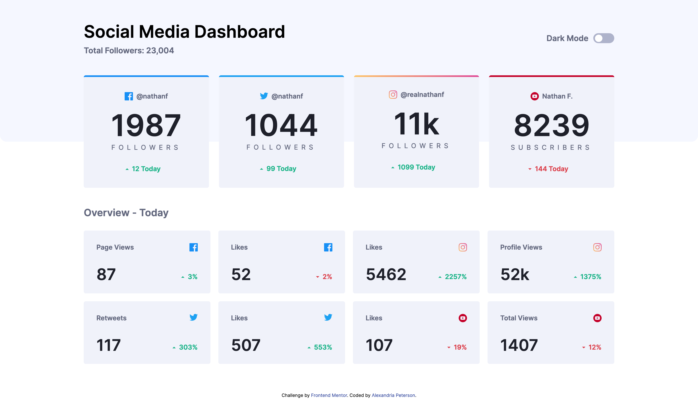
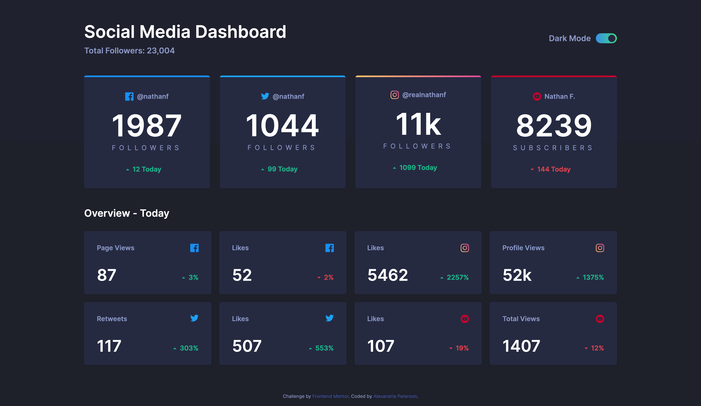
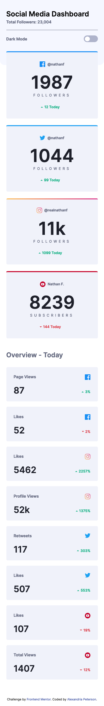
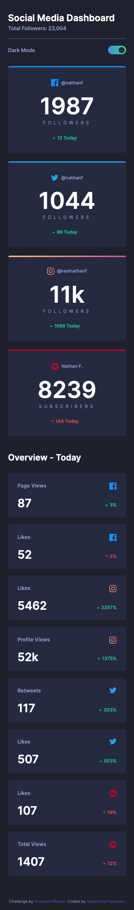
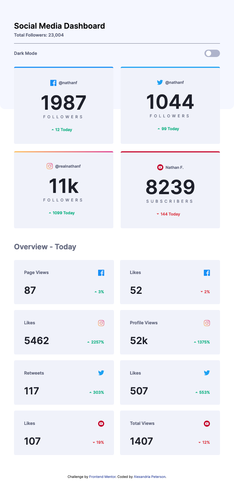
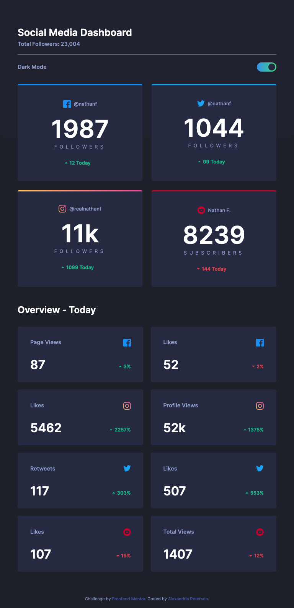

# Frontend Mentor - Social Media Dashboard with Theme Switcher Challenge

This is my coded solution to the Social Media Dashboard with Theme Switcher from Frontend Mentor
https://www.frontendmentor.io/challenges/social-media-dashboard-with-theme-switcher-6oY8ozp_H

### The Challenge
- Replicate the design using best visual approximations of measurements (no explicit element positioning or dimesions given) 
- Users should be able to view the optimal layout for both desktop and mobile devices using 1440px and 375px viewport widths respectively.
- See active hover states for all interactive elements
- Toggle theme to user's preference 

### Built With
- Semantic HTML5 Markup
- CSS3
- Flexbox
- CSS Grid
- Mobile-first workflow
- JavaScript

### Screenshots 

#### Desktop

#### Mobile
 

#### Tablet 

### Deployed
https://social-media-dashboard-m1wg7ov5e-alexvalpeter.vercel.app/
