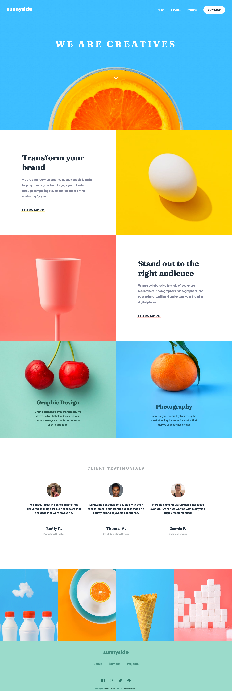
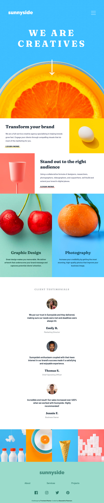
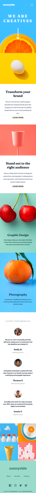
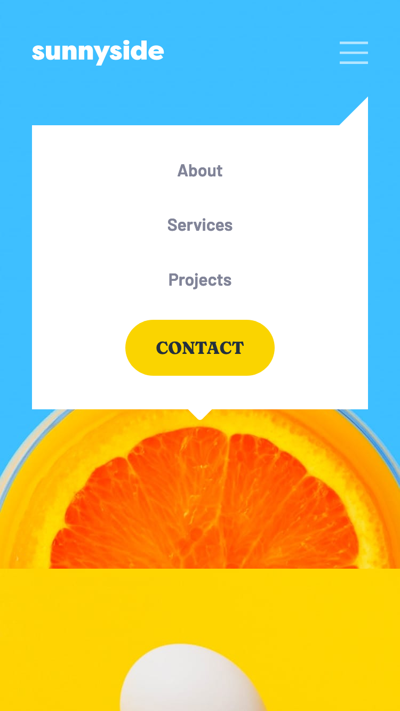
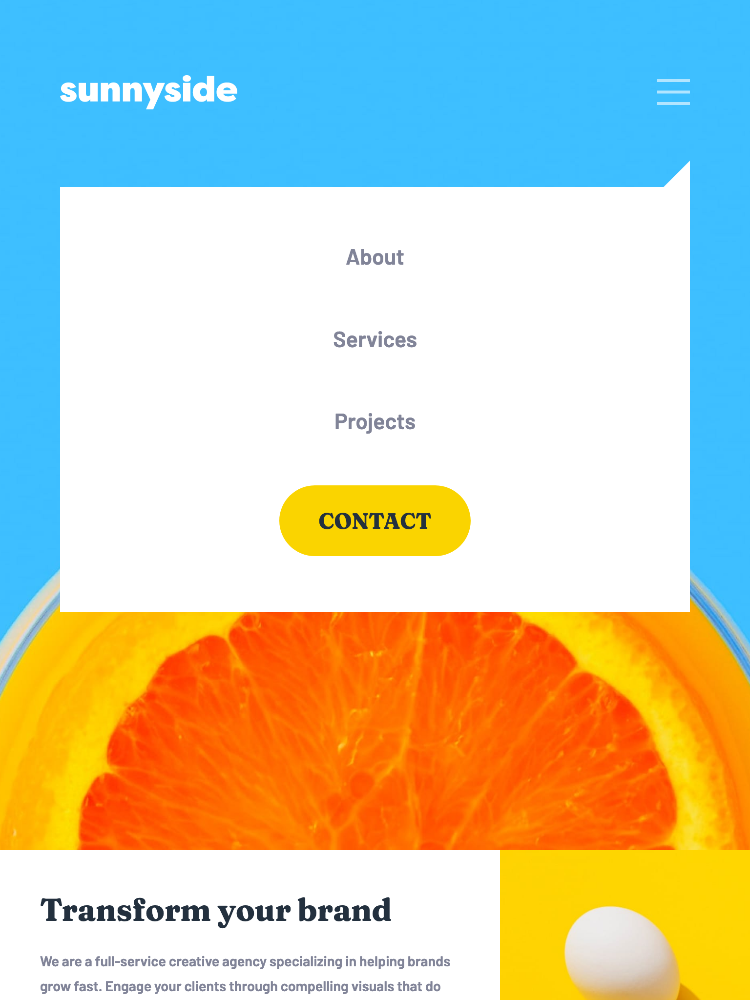

# Frontend Mentor - Sunnyside Agency Landing Page

This is my coded solution to the Sunnyside Agency Landing Page (https://www.frontendmentor.io/challenges/sunnyside-agency-landing-page-7yVs3B6ef)

### The Challenge
 - Replicate the design using best visual approximations of measurements (no explicit element positioning or dimesions given) 
- Users should be able to view the optimal layout for both desktop and mobile devices using 1440px and 375px viewport widths respectively.
- See active hover states for all interactive elements

### Built With
- Semantic HTML Markup
- CSS (SCSS)
- Mobile-first workflow
- Responsive design
- Flexbox
- CSS Grid

### Screenshots

#### Desktop

#### Tablet

#### Mobile

##### Navigation
 

### Deployed
https://sunnyside-6thujscyl-alexvalpeter.vercel.app/

