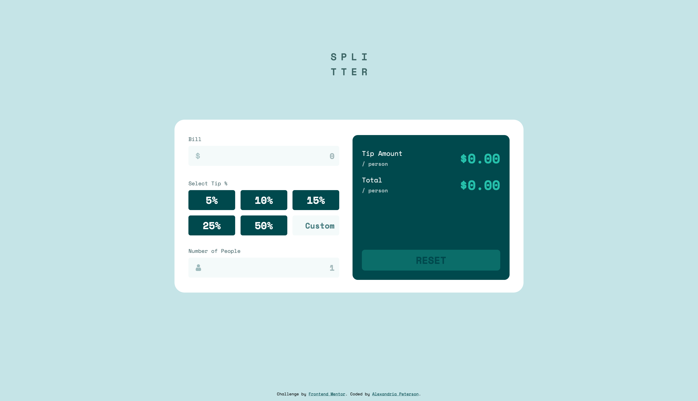
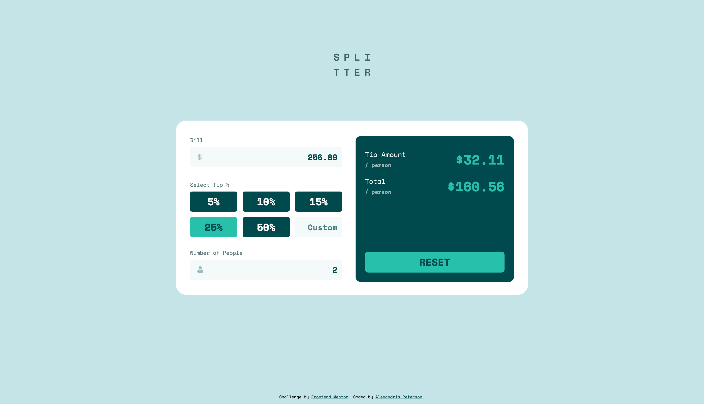
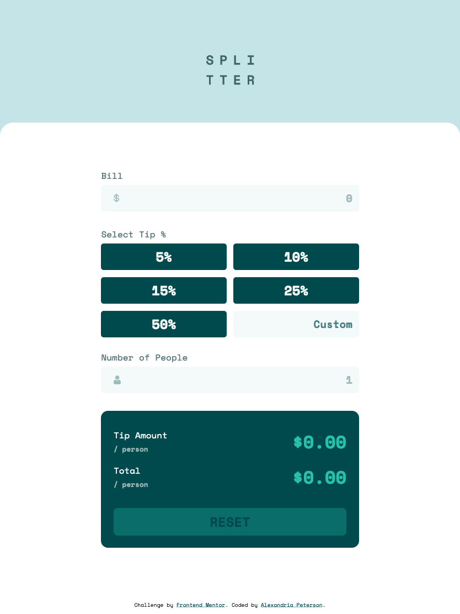
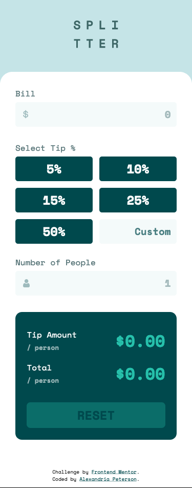

# Frontend Mentor - Tip Calculator App

This is my coded solution to the Tip Calculator App Challenge (https://www.frontendmentor.io/challenges/tip-calculator-app-ugJNGbJUX)

### The Challenge
 - Replicate the design using best visual approximations of measurements (no explicit element positioning or dimesions given) 
- Users should be able to view the optimal layout for both desktop and mobile devices using 1440px and 375px viewport widths respectively.
- See active hover states for all interactive elements
- Calculate the correct tip and total cost of the bill per person

### Built With
- Semantic HTML Markup
- CSS (SCSS)
- Mobile-first workflow
- Responsive design
- Flexbox
- CSS Grid
- JavaScript

### Screenshots

#### Desktop

#### Tablet

#### Mobile

### Deployed

https://tip-calculator-ojyn6zt4c-alexvalpeter.vercel.app/
